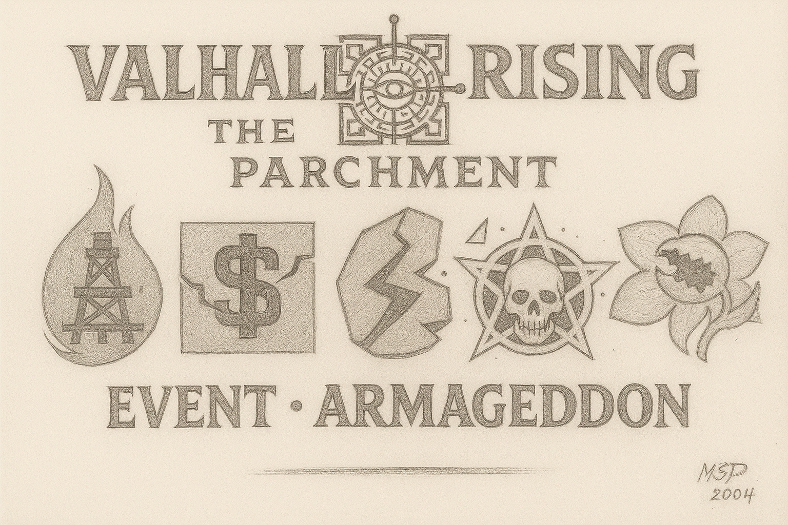

  

---

# 🌌 EVENT – ARMAGEDDON  
### 🇨🇦 EN-CA | 🇨🇦 FR-CA

## 🧩 Introduction (EN-CA)  
_Armageddon is a catastrophic universal anomaly — the breaking of the celestial balance._  
_When the seals of power were shattered, five colossal forces rose in the cosmos, each embodying a domain of corruption: Fire, Greed, Rupture, Death and Deception._

This event serves as a lore milestone and a massive gameplay escalation. Players will witness the beginning of chaos across the universe of **Valhalla Rising – The Parchment**.

---

## 🛡️ Purpose  
This repository contains files, concepts and logic related to the **Armageddon event** in the game:  
- Visual & symbolic representations  
- Lore-based references  
- Game mechanics and narrative triggers  
- Future quest/event integration

---

## 🎯 Gameplay Focus  
- World-tier escalation mechanics  
- PvE Armageddon Boss activation  
- Special temporary runes and abilities  
- Global debuffs and resistance auras  
- Lore-driven quests with irreversible outcomes

---

## 🇨🇦 VERSION FR-CA ↓

## 🧩 Introduction (FR-CA)  
_Armageddon est une anomalie cosmique — la rupture de l’équilibre_

Armageddon – Elsbeth (DE)
Elsbeth war eine Älteste vom Planeten Tártaros, wo sie dem Gott Krom diente – kalt und erbarmungslos. Einst war sie eine Frau mit normalen Proportionen, doch ihre Schriftrollen wurden vom Zauberer Wolfgard gestohlen, der stets ihre Position als Mittlerin Kroms begehrte. Der Planet Tártaros wurde mit eiserner Faust von Krom regiert, und das Volk lebte in ständiger Verzweiflung.

Elsbeth fühlte tiefes Mitgefühl für das Leid der Menschen und verbündete sich eines Tages mit einer anderen Ältesten – Morgana Le Fey. Gemeinsam erschufen sie Elixiere, um dem Volk Mut zu machen, sich gegen Krom zu erheben und seine Schreckensherrschaft zu beenden. Doch Elsbeth ahnte nicht, dass Morgana heimlich die Geliebte von Wolfgard war. Alles, was Elsbeth Morgana anvertraute, gelangte sofort in Wolfgards Hände – der daraufhin die Elixiere sabotierte.

Das Volk vertraute Elsbeth zutiefst und nahm die Elixiere ein – doch statt Mut zu spenden, verwandelten sie die Menschen in rasende Bestien, die sich gegenseitig angriffen. Morgana spielte die Verzweifelte und verschwand. Wolfgard präsentierte nun ein Gegenelixier, das die Wut und Raserei heilte – und wurde als Held gefeiert, der alle rettete. Er übernahm den Platz von Elsbeth als oberster Ältester.

Elsbeth wurde in Ketten gelegt, gepeitscht und ins Gefängnis geworfen. In der Dunkelheit der Nacht erschienen Morgana und Wolfgard in ihrer Zelle und offenbarten ihr voller Spott die ganze Intrige. Vom Schmerz des Verrats gezeichnet, schrie Elsbeth in Raserei – bis sie von ihren Zaubern zum Schweigen gebracht wurde.

Am Morgen wurde sie in die größte Stadt Tártaros gebracht, wo sie beleidigt und mit Gegenständen beworfen wurde. Auf einem Holzstoß gefesselt, sollte sie bei lebendigem Leib verbrannt werden. Krom verweigerte ihr das Recht auf letzte Worte – doch da erschien ein gleißendes Licht: die Geschwister Frey und Freya, Abgesandte der Gerechtigkeit. Sie erinnerten Krom an seine göttliche Pflicht: nicht Hass zu nähren, sondern Gerechtigkeit zu wahren.

Krom gewährte Elsbeth das Wort. In Flammen der Wahrheit bekannte sie ihre Liebe zu Krom – weil er einst gerecht war – aber ihn zugleich anklagte: er sei gierig und korrupt geworden, habe Verrat und Gewalt geduldet. Sie forderte ihn auf, die Wahrheit zu suchen. Krom lachte nur höhnisch und befahl, das Feuer zu entfachen.

Frey und Freya retteten Elsbeth im letzten Moment, doch ihre Seele war zerbrochen. Um ihr eine zweite Chance zu geben, brachten sie sie nach Valhalla Rising – The Parchment, in das Event Armageddon, wo sie sich selbst erlösen kann. Sobald sie heilt, wird sie in eine Welt des Friedens und der Stille gesandt...

Français - Paris - Canada

Elsbeth est une ancienne de la planète Tartaros, alors qu'elle sert le dieu froid et impitoyable Krom ; Elsbeth était une personne de proportions normales, jusqu'à ce que ses parchemins soient usurpés par le sorcier Wolfgard, qui a toujours convoité la position d'Elsbeth, car elle était un intermédiaire pour le dieu Krom ; la planète Tartaros était dirigée d'une main de fer par Krom et la population était toujours désespérée ; Elsbeth fut émue par la douleur des citoyens, jusqu'au jour où elle s'allia à une autre aînée, Morgana Le Fey ; les deux ont créé des élixirs pour donner du courage au peuple pour se soulever contre Krom et ainsi mettre fin à son règne de terreur et de désespoir ; ce qu'Elsbeth n'imaginait pas, c'est que Morgane était l'amante de Wolfgarh et toutes les informations qu'Elsbeth partageait avec Morgane, Wolfgarh les découvrit et ainsi, adultéra les élixirs d'Elsbeth ; La population tenait Elsbeth en haute estime et lui faisait confiance, ils buvaient les élixirs, mais l'effet était inverse : ils commencèrent à s'entretuer ! Morgane feignit le désespoir et quitta la scène et Wolgarh avait créé l'élixir qui guérissait les effets de la fureur et de l'irrationalité des personnes qui avaient souffert de l'élixir frelaté d'Elsbeth ; Krom prit conscience et ordonna qu'Elsbeth soit exécutée sur une place publique et Wolfgarh devint le héros acclamé, qui sauva tout le monde de la folie et assuma la position de maître aîné, qui appartenait à Elsbeth ; Elsbeth fut enchaînée, fouettée et emmenée en prison, où au milieu de la nuit, Morgana et Wolfgard se rendirent dans sa cellule et révélèrent le sabotage à Elsbeth ; Marquée par la douleur de la déception et de la trahison, Elsbeth commença à crier irrationnellement jusqu'à ce qu'elle soit réduite au silence par les sorts combinés de Morgana et Wolfgard ; A l'aube, Elsbeth, enchaînée, fut emmenée au milieu de la plus grande place de Tartaros, où les gens l'attaquèrent, avec des mots et des jets d'objets sur elle ; Elsbeth a été attachée à une plate-forme remplie de bois de chauffage pour être brûlée vive ! Krom ordonna d'allumer le feu, mais Elsbethy cria, lui parlant du droit au dernier mot ; Krom lui refusa ce droit et soudain, une lumière apparut, qui illumina tout l'endroit ; c'étaient les frères et sœurs Frey et Freya, s'adressant à Krom, lui rappelant son statut divin de dieu de ce monde et que le rôle de chaque dieu était d'imposer la justice, non la haine, la vengeance et de favoriser la trahison ; Krom écouta ses frères et donna la parole à Elsbethy, qui dit qu'elle aimait Krom, parce qu'elle le considérait comme fort et juste, mais qu'au fil des millénaires, il devint égoïste et avide ; favorisant les actes de trahison, de violence et tout fardeau de mal et d’injustice ; Elsbethy a révélé qu'elle était exécutée pour la trahison de Morgana et Wolfgahr et que Krom, le dieu, devrait découvrir la vérité avant de prendre parti dans l'exécution ; Krom sourit ironiquement et dit aux frères Frey et Freya de ne pas intervenir et ainsi, il ordonna que le feu soit allumé, brûlant Elsbethy, qui hurla de douleur et d'agonie ; Frey et Freya l'ont sauvée avant qu'elle ne meure, mais l'âme d'Elsbethy avait été perdue dans la douleur et la folie ; Les frères décidèrent donc de l'emmener à Valhalla Rising - Le Parchemin, lors de l'événement Armeggeddon, afin qu'elle puisse se racheter et qu'une fois rétablie, elle soit envoyée dans un monde plein de paix et de sérénité...

English - Global - Canadá, United States, United Kingdom; Australia, Oceania, South Africa

Elsbeth is an elder from the Planet Tartaros, as she serves the cold and merciless God Krom; Elsbeth was a person of normal proportions, until her scrolls were usurped by the sorcerer Wolfgard, who always coveted Elsbeth's position, as she was an intermediary for the God Krom; the planet Tartaros was ruled with an iron fist by Krom and the population was always in despair; Elsbeth was touched by the pain of the citizens, until one day, she allied herself with another elder, Morgana Le Fey; the two created elixirs to give courage to the people to rise up against Krom and thus end his reign of terror and despair; what Elsbeth did not imagine, that Morgana was Wolfgarh's lover and all the information that Elsbeth shared with Morgana, Wolfgarh found out and thus, adulterated Elsbeth's elixirs; the population held Elsbeth in high regard and trusted her, they drank the elixirs, but the effect was the opposite: they began to kill each other! Morgana feigned despair and left the scene and Wolgarh had created the elixir that cured the effects of fury and irrationality of the people who had suffered from Elsbeth's adulterated elixir; Krom became aware and ordered Elsbeth to be executed, in a public square and Wolfgarh became the acclaimed hero, who saved everyone from madness and assumed the position of elder master, which belonged to Elsbeth; Elsbeth was chained, whipped and taken to prison, where in the dead of dawn, Morgana and Wolfgard went to her cell and revealed the sabotage to Elsbeth; marked by the pain of disappointment and betrayal, Elsbeth began to scream, irrationally, until she was silenced by the combined spells of Morgana and Wolfgard; At dawn, Elsbeth, chained, was taken to the middle of the largest square in Tartaros, where people attacked her, with words and throwing objects at her; Elsbeth was tied to a platform, full of firewood, to be burned alive! Krom ordered that the bonfire be lit, but Elsbethy screamed, telling him about the right to the last word; Krom denied her this right and suddenly, a light came, which illuminated the entire place; it was the brothers Frey and Freya, addressing Krom, reminding him of his divine status as god of that world and that the role of every god was to impose justice, not hatred, revenge and favor betrayal; Krom listened to the brothers and gave the word to Elsbethy, who said that she loved Krom, because she considered him strong and just, but as the millennia passed, he became selfish and greedy; favoring acts of betrayal, violence and all the burden of evil and injustice; Elsbethy revealed that she was being executed for Morgana and Wolfgahr's betrayal and that Krom, the god, should find out the truth before taking sides in the execution; Krom smiled ironically and told the brothers Frey and Freya not to interfere and so, he determined that the bonfire should be lit, burning Elsbethy, who screamed in pain and agony; Frey and Freya rescued her before she died, but Elsbethy's soul had been lost in pain and madness; so the brothers decided to take her to Valhalla Rising - The Parchment, in the Armeggeddon event, so that she could redeem herself before herself and when she recovered, she would be sent to a world full of peace and serenity...
