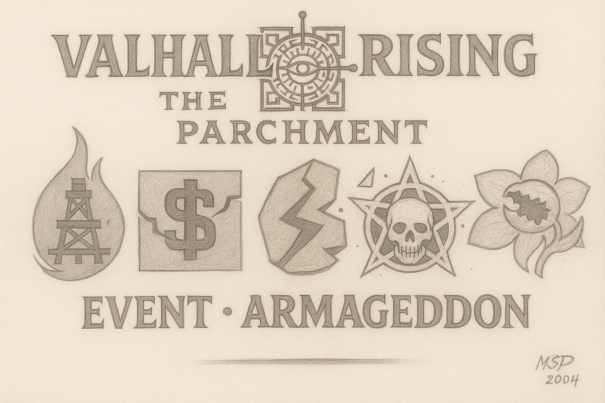

  

---

# 🌌 EVENT – ARMAGEDDON  
### 🇨🇦 EN-CA | 🇨🇦 FR-CA

## 🧩 Introduction (EN-CA)  
_Armageddon is a catastrophic universal anomaly — the breaking of the celestial balance._  
_When the seals of power were shattered, five colossal forces rose in the cosmos, each embodying a domain of corruption: Fire, Greed, Rupture, Death and Deception._

This event serves as a lore milestone and a massive gameplay escalation. Players will witness the beginning of chaos across the universe of **Valhalla Rising – The Parchment**.

---

## 🛡️ Purpose  
This repository contains files, concepts and logic related to the **Armageddon event** in the game:  
- Visual & symbolic representations  
- Lore-based references  
- Game mechanics and narrative triggers  
- Future quest/event integration

---

## 🎯 Gameplay Focus  
- World-tier escalation mechanics  
- PvE Armageddon Boss activation  
- Special temporary runes and abilities  
- Global debuffs and resistance auras  
- Lore-driven quests with irreversible outcomes

---

## 🇨🇦 VERSION FR-CA ↓

## 🧩 Introduction (FR-CA)  
_Armageddon est une anomalie cosmique — la rupture de l’équilibre_
